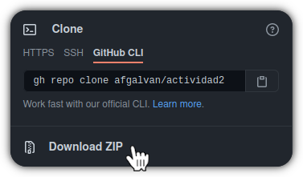

<h1 align="center">
    <span> Proyecto de aula - Programación II.</span>
    <br />
</h1>

<p align="center">
    <a href="https://www.oracle.com/java/technologies/javase/javase-jdk8-downloads.html">
        
    </a>
    <a href="https://www.codacy.com/gh/afgalvan/programmingII-finalProject/dashboard?utm_source=github.com&amp;utm_medium=referral&amp;utm_content=afgalvan/programmingII-finalProject&amp;utm_campaign=Badge_Grade">
        
    </a>
    <a href="https://github.com/afgalvan/programmingII-finalProject/pulls/" title="Pull request">
        
    </a>
    <a href="https://github.com/afgalvan/programmingII-finalProject/issues/" title="Issues">
        
    </a>
    <a href="https://github.com/marketplace/actions/super-linter)" title="Lint Status">
        
    </a>
    <!-- <a href="https://github.com/afgalvan/JavaMySQL/actions">
        
    </a> -->
</p>

<p align="center">
    El Consejo Superior de la Judicatura ha decido implementar el Plan de Digitalización de los
    despachos Judiciales en todo el País, con el que busca digitalizar todos los procesos que se
    tramitan por los Juzgados en cada especialidad.
    La contratista GestData ha sido la compañía seleccionada por la entidad para ejecutar éste
    proyecto de gran impacto. Dentro  de  los compromisos requeridos  por  la contratista, se
    encuentra  la  elaboración e  implementación  del  software  de gestión documental para el
    registro de los procesos digitalizados, y la consulta de los mismos por parte de los
    diferentes Juzgados y usuarios interesados.
</p>

## Obtener el proyecto

### Descargar desde github.com




### Desde la línea de comandos

Asegurate de tener git instalado.

```bash
git --version
```

Clona el repositorio.

```bash
git clone https://github.com/afgalvan/programmingII-finalProject.git

# With ssh
git clone git@github.com:afgalvan/programmingII-finalProject.git
```

## Contributors ✨

Thanks goes to these wonderful people ([emoji key](https://allcontributors.org/docs/en/emoji-key)):

<!-- ALL-CONTRIBUTORS-LIST:START - Do not remove or modify this section -->
<!-- prettier-ignore-start -->
<!-- markdownlint-disable -->
<table>
  <tr>
    <td align="center"><a href="https://github.com/afgalvan"><br /><sub><b>Andrés Galván</b></sub></a><br /><a href="#infra-afgalvan" title="Infrastructure (Hosting, Build-Tools, etc)">🚇</a> <a href="https://github.com/afgalvan/programmingII-finalProject/commits?author=afgalvan" title="Code">💻</a></td>
    <td align="center"><a href="https://github.com/jwar28"><br /><sub><b>Javier Guerra</b></sub></a><br /><a href="https://github.com/afgalvan/programmingII-finalProject/commits?author=jwar28" title="Code">💻</a></td>
  </tr>
</table>

<!-- markdownlint-restore -->
<!-- prettier-ignore-end -->

<!-- ALL-CONTRIBUTORS-LIST:END -->

This project follows the [all-contributors](https://github.com/all-contributors/all-contributors) specification. Contributions of any kind welcome!